# Network Topology

## Diagram

```mermaid
graph TD
  XR[Xfinity Router 10.0.0.1] --- SW[Unmanaged Switch]
  SW --- WS1[workstation-01 10.0.0.x]
  SW --- ASR[asrock12700k 10.0.0.181]
  SW --- PVE[Proxmox Host 10.0.0.x]
  PVE --- VM1[ubuntu-desktop VM]
  PVE --- VM2[ubuntu-server VM]
  XR --- WIFI[Wi-Fi Clients - family & laptop]
  WIFI --- LTP[ethansg5laptop]
  WIFI --- S22[Ethan-s-S22 10.0.0.141]
  WIFI --- ERM[EntertamentRoom 10.0.0.198]
  WIFI --- GS[GrassShack 10.0.0.98]
  WIFI --- WTV[50WestinghouseRokuTV 10.0.0.2]
  WIFI --- ROK[RokuPlayer 10.0.0.128]
  WIFI --- SAM[Samsung 10.0.0.149]
  WIFI --- T901[T901 10.0.0.191]
  WIFI --- TAB1[ac:f4:2c:20:64:64 10.0.0.159]
  WIFI --- TAB2[36:8d:fc:18:0e:c9 10.0.0.52]
  WIFI --- TAB3[3e:2a:59:de:20:4b 10.0.0.163]
  WIFI --- TAB4[cc:5b:31:b6:95:4b 10.0.0.89]
  WIFI --- SYL0[sylvania-bulb-0 10.0.0.50]
  WIFI --- SYL1[sylvania-bulb-1 10.0.0.51]
  WIFI --- SYL3[sylvania-bulb-3 10.0.0.53]
  WIFI --- SYL4[sylvania-bulb-4 10.0.0.54]
  WIFI --- SYLSTRIP[sylvania-strip-5 10.0.0.55]
  XR --- XBOX[Xbox Series X 10.0.0.150]
  XR --- ETH[Ethernet Clients]
  ETH --- ETH1[ethan-Standard-PC-i440FX-PIIX-1996 10.0.0.86]
  ETH --- ETH2[18:C0:4D:69:27:14 Proxmox server 10.0.0.100]
```

## Table View

| Source         | Connected Device                         | Label / Notes                                      | IP Address        |
|----------------|------------------------------------------|----------------------------------------------------|-------------------|
| XR (Xfinity Router) | SW (Unmanaged Switch)                    |                                                    |                   |
| XR             | WIFI                                      | Wi-Fi Clients - family & laptop                    |                   |
| XR             | XBOX                                      | Xbox Series X                                      | 10.0.0.150        |
| XR             | ETH                                       | Ethernet Clients                                   |                   |
| SW             | WS1                                       | workstation-01                                     | 10.0.0.x          |
| SW             | ASR                                       | asrock12700k                                       | 10.0.0.181        |
| SW             | PVE                                       | Proxmox Host                                       | 10.0.0.x          |
| PVE            | VM1                                       | ubuntu-desktop VM                                  | -                 |
| PVE            | VM2                                       | ubuntu-server VM                                   | -                 |
| WIFI           | LTP                                       | ethansg5laptop                                     | -                 |
| WIFI           | S22                                       | Ethan-s-S22                                        | 10.0.0.141        |
| WIFI           | ERM                                       | EntertamentRoom                                    | 10.0.0.198        |
| WIFI           | GS                                        | GrassShack                                         | 10.0.0.98         |
| WIFI           | WTV                                       | 50WestinghouseRokuTV                               | 10.0.0.2          |
| WIFI           | ROK                                       | RokuPlayer                                         | 10.0.0.128        |
| WIFI           | SAM                                       | Samsung                                            | 10.0.0.149        |
| WIFI           | T901                                      | T901                                               | 10.0.0.191        |
| WIFI           | TAB1                                      | ac:f4:2c:20:64:64                                  | 10.0.0.159        |
| WIFI           | TAB2                                      | 36:8d:fc:18:0e:c9                                  | 10.0.0.52         |
| WIFI           | TAB3                                      | 3e:2a:59:de:20:4b                                  | 10.0.0.163        |
| WIFI           | TAB4                                      | cc:5b:31:b6:95:4b                                  | 10.0.0.89         |
| WIFI           | SYL0                                      | sylvania-bulb-0                                    | 10.0.0.50         |
| WIFI           | SYL1                                      | sylvania-bulb-1                                    | 10.0.0.51         |
| WIFI           | SYL3                                      | sylvania-bulb-3                                    | 10.0.0.53         |
| WIFI           | SYL4                                      | sylvania-bulb-4                                    | 10.0.0.54         |
| WIFI           | SYLSTRIP                                  | sylvania-strip-5                                   | 10.0.0.55         |
| ETH            | ETH1                                      | ethan-Standard-PC-i440FX-PIIX-1996                 | 10.0.0.86         |
| ETH            | ETH2                                      | 18:C0:4D:69:27:14 Proxmox server                   | 10.0.0.100        |

